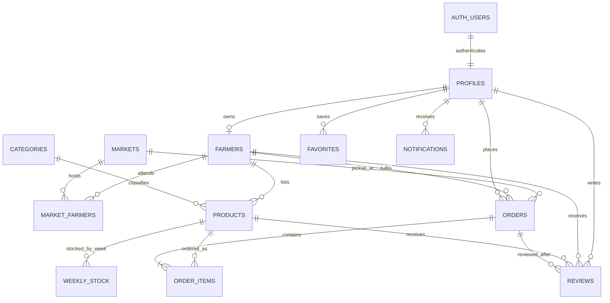

# MarketLink database schema and test guide

This guide documents the current PostgreSQL schema, relationships, data rules and test suites. The executable source of truth remains the ordered SQL migrations under `db/migrations/` and the checks under `db/tests/`.

## Database diagram



`AUTH_USERS` is Supabase Auth's user table (or the local auth stand-in for development). The administrator uses server-configured credentials and does not need a seeded admin password.

## Tables

| Table | Main columns | Keys, links and purpose |
|---|---|---|
| `profiles` | `id`, `role`, `full_name`, `phone`, `address`, `avatar_url`, `country`, `is_active`, timestamps | Primary key is the auth user ID; cascades when that identity is deleted. Role is customer, farmer or admin. |
| `markets` | `id`, `name`, `address`, `city`, `state`, `country`, `currency`, `timezone`, `lat`, `lng`, `operating_days`, `opens_at`, `closes_at`, `image_url`, `is_active`, timestamps | Geographic and trading information for a pickup market. Coordinates are bounded; opening time must precede closing time; country/currency/time zone are required. |
| `categories` | `id`, `name`, `slug`, `icon_key`, `sort_order` | Unique category names and lowercase URL-safe slugs. |
| `farmers` | `id`, `profile_id`, `stall_name`, `contact_person`, `description`, `logo_url`, `cover_url`, `lat`, `lng`, `country`, `currency`, `operating_days`, `pickup_window_start`, `pickup_window_end`, `order_cutoff_minutes`, `status`, rating fields, timestamps | One stall per profile. Status is pending/approved/suspended. The pickup window is ordered and cutoff is nonnegative. |
| `market_farmers` | `market_id`, `farmer_id`, `stall_ref`, `days` | Composite primary key `(market_id, farmer_id)` records which pitches and trading days belong to each farmer-market association. |
| `products` | `id`, `farmer_id`, `category_id`, `name`, `description`, `unit`, `price_minor`, `image_urls`, `template_qty`, `is_organic`, `is_active`, rating fields, timestamps | Farmer-owned listing. Category deletion is restricted; farmer deletion cascades. Price and quantities are positive/nonnegative integers. |
| `weekly_stock` | `product_id`, `week`, `quantity_available`, `is_sold_out`, `updated_at` | Composite primary key `(product_id, week)`. Week uses ISO form such as `2026-W39`; quantities cannot be negative. |
| `orders` | `id`, `reference`, `customer_id`, `farmer_id`, `market_id`, `status`, `subtotal_kobo`, `delivery_fee_kobo`, `pickup_date`, `pickup_slot_start`, `pickup_slot_end`, `cutoff_at`, lifecycle timestamps, `cancel_reason`, timestamps | One farmer and market per order. Status tracks placed through completion or cancellation. Delivery fee is constrained to zero; pickup slot must be ordered. `subtotal_kobo` is a legacy column name and stores the integer amount in the order's currency minor unit. |
| `order_items` | `order_id`, `product_id`, `product_name_snapshot`, `unit_snapshot`, `price_kobo_snapshot`, `quantity` | Composite primary key `(order_id, product_id)`. Snapshots preserve receipt names/prices; quantity must be positive. `price_kobo_snapshot` is a legacy name for a minor-unit amount. |
| `reviews` | `id`, `order_id`, `product_id`, `farmer_id`, `customer_id`, `rating`, `title`, `body`, `farmer_reply`, `replied_at`, `status`, `created_at` | Review links to a completed order/product and the customer/farmer. Rating is 1–5; one review per product per order. |
| `favorites` | `id`, `profile_id`, `target_type`, `target_id`, `created_at` | Unique saved target per profile; target type can be farmer, product or market. A trigger checks that the polymorphic target exists. |
| `notifications` | `id`, `profile_id`, `kind`, `title`, `body`, `link`, `read_at`, `created_at` | In-app messages for order, low stock, restock and announcement events. |

### Data integrity and access

- Money is stored in integer minor units, not floating-point columns. Product prices use the neutral name `price_minor`; two older order columns retain their `kobo` names for historical compatibility.
- Orders reserve weekly stock through guarded updates. The database rejects negative stock, zero-quantity order lines, duplicate product lines on one order, and invalid pickup slot order.
- Foreign keys cascade or restrict deletion according to the history that must be retained.
- Migration `0008_row_level_security.sql` enables and forces RLS on public application tables. Direct reads by `anon`/`authenticated` are denied; the API uses the server-only `service_role` path after authorization.
- Updated-at triggers maintain modification timestamps. API validation and transactional service logic enforce multi-row workflows such as checkout and order edits.

## Demo data

The Lagos seed currently contains **3 markets**, **5 categories**, **29 farmer stalls** (28 approved and 1 pending), **29 market-farmer roster rows**, and **80–100 products**. It creates a current-ISO-week stock row for every seeded product. These counts are asserted in `db/tests/0002_seed.sql`, so update this page if the seed/test contract changes. The seeded evaluation emails and demo password are documented in [README.md](../README.md); use only in an isolated evaluation environment.

## Database test suite

Database checks use pgTAP and run each SQL file inside a transaction that rolls back its probes.

| File | Assertions | What it checks |
|---|---:|---|
| `db/tests/0001_schema.sql` | 31 | Twelve application tables exist; money columns use integer `bigint`; slugs, required country/currency/time zone, ISO-week calculation and RLS access rules behave as intended. |
| `db/tests/0002_seed.sql` | 9 | Seed counts and states are correct, stalls are rostered, products exist and every listing has this week's stock row. |
| `db/tests/0003_stock_guard.sql` | 7 | Order references, guarded sell-down, nonnegative stock, positive/unique order items and a valid cutoff window. |

Run against a test database after applying migrations and seed data:

```bash
npm run db:migrate
npm run db:seed
npm run db:test
```

The database test runner requires pgTAP. Local Postgres container and Supabase instructions are in [db/README.md](../db/README.md). Do not point destructive test setup at production data.

## Application test suites

Run server and client Vitest suites from the repository root:

```bash
npm test
```

The server tests cover authentication/role gates, profile bootstrap, farmer and market APIs, geocoding and geographic helpers, health/error responses, environment parsing, SQL shape/parity and OpenAPI contract. The client tests cover API/gateway/auth state, protected routes and forms, market/product discovery UI helpers, currency formatting and shared controls. Vitest uses mocked services/data and does not replace the PostgreSQL/pgTAP checks or a manual browser walkthrough.

The last recorded application test run, before the recent catalogue/pickup/chatbot update, reported **server 128 passed and 10 failed (138 total)** and **client 49 passed and 31 failed (80 total)**. These suites have not been rerun after that update. The current production build does pass; see the [project report](project-implementation-notes.md) for the current readiness summary.
