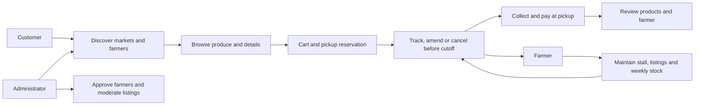
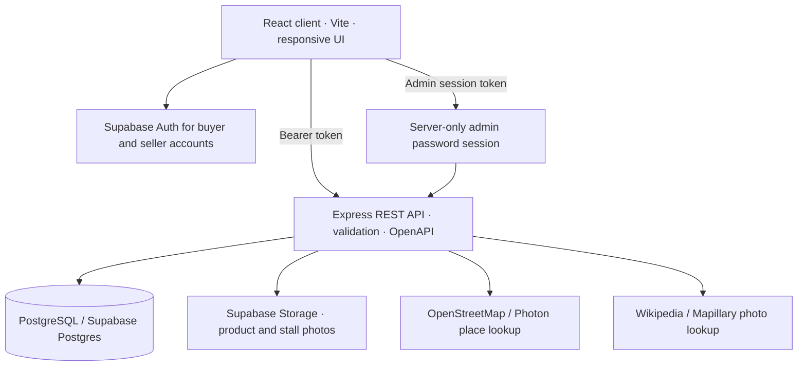
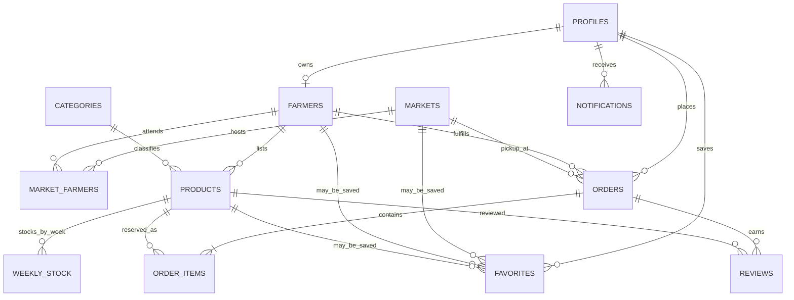

# MarketLink Project Report

## Project summary

MarketLink is a responsive produce marketplace for connecting shoppers with African farmers and open-air markets. A customer discovers a market or farmer, chooses produce, and reserves it for a scheduled pickup. Farmers maintain stall details, weekly stock and orders. Administrators moderate the marketplace. Payment is collected in person at pickup; online payments and delivery are outside this project scope, as directed by the supplied SRS.

The visual direction follows the supplied ten-screen reference with a light-market refresh: warm white surfaces, forest-green actions, clear availability states, map-led market discovery, product cards and separate customer/farmer/admin workspaces.

## Main workflows



## Application architecture



The browser uses the API for marketplace data and uploads. The Supabase service-role key stays on the server. Product uploads are limited to JPEG, PNG or WebP files up to 5 MB and stored under the farmer's profile. Place discovery tries OpenStreetMap market data and falls back to Photon when an Overpass mirror times out; optional place photos are linked to their source.

## Data design

| Entity | Purpose and relationships |
|---|---|
| `profiles` | Authenticated customer/farmer identity and account status. The administrator signs in using a separate server-side password session. |
| `markets` | Named market, city/address, coordinates, active state and operating hours. |
| `farmers` | Stall profile, approval state, pickup hours/cutoff, currency and location; linked to a profile. |
| `market_farmers` | Many-to-many association between stalls and markets, including trading days. |
| `categories` | Product category master list. |
| `products` | Farmer-owned listing, price, media, category and recurring `template_qty`. |
| `weekly_stock` | Per-product ISO-week quantity and sold-out override; orders reserve and restore quantities. |
| `orders`, `order_items` | Customer pickup reservation, status history and fixed-at-order item prices. One order belongs to one farmer/market pickup. |
| `favorites` | Customer-saved market, farmer or product. Restock alerts are generated for saved products. |
| `reviews` | One review per product per completed order, with farmer reply and moderation state. |
| `notifications` | In-app order, announcement and restock notices. |



Schema changes are numbered SQL migrations in `db/migrations/`; demo data is in `db/seed/`. Weekly stock templates are applied lazily when a product is read or ordered in a new ISO week. Farmers can edit the recurring default separately from current-week stock.

## Requirement coverage

| SRS area | Current implementation |
|---|---|
| Customer accounts and discovery | Sign-up/sign-in, profile editing, market list/map, market search and market/farmer profiles. |
| Product discovery | Search, category/market/market-day/price/availability filters, product details and matched product photos where available, with crop-specific artwork when there is no matching photograph. |
| Pickup ordering | Cart, scheduled pickup checkout, in-person payment, order tracking, item edits/cancellation before cutoff, order history and stock reservation. |
| Customer engagement | Favorites, completed-order reviews, farmer replies and in-app order/restock/announcement notifications. |
| Farmer tools | Stall profile and map pin, market schedule, product photo upload, current and recurring weekly stock, order status management, sales/order insights and review replies. |
| Administration | Farmer approvals and account controls, market/category management, product/review moderation, announcements and reports. |
| Maps and contact | Market map and directions, farmer pickup map pins and directions, and a Contact page that reads team details/map coordinates from the public `VITE_CONTACT_*` client settings. Those settings must be filled with team-approved public details before evaluation. |
| Accessibility and performance | Responsive layouts, skip-to-content link, labeled controls and reduced-motion handling; route-level code splitting keeps the largest initial client chunk below 500 kB. |
| Optional AI assistant | Not implemented; optional in the SRS and not required for core operation. |
| Payment and fulfillment | Pickup-only flow; no online payment processing or delivery workflow. |

## Setup and evaluation

Follow the installation and environment-variable steps in [README.md](../README.md) and [db/README.md](../db/README.md). Product/stall image bucket setup is documented in [product-image-storage.md](product-image-storage.md). The Lagos demo seed includes customer and farmer accounts listed in the root README. Admin access uses `ADMIN_EMAIL` and a server-only `ADMIN_PASSWORD`; see [Private admin access](admin-access.md). The supplied [SRS](reference/MarketLink%20End-to-End%20Web%20Solutions_SRS.pdf) is included for a self-contained handoff.

Useful project commands:

```bash
npm install
npm run db:migrate
npm run db:seed
npm run dev
npm run build
npm run openapi
```

The API schema is generated at `openapi.json`. Database checks are under `db/tests/`; application tests are in workspace `test/` folders. For this implementation update, production compilation and OpenAPI generation succeeded. The production client is split by route; its largest initial JavaScript chunk is 473.10 kB before gzip. Automated tests were not run during this update.

## Remaining evaluation deliverables

The executable web app, source, migrations, seeds, setup instructions and generated OpenAPI contract are in the repository. A recording outline is in [demo-video-script.md](demo-video-script.md). A packaged ZIP is created as a separate release artifact; the actual demonstration video still needs to be recorded from the intended demo environment.

The SRS calls for a recorded demonstration video. The repository contains a [demo video script](demo-video-script.md), but the recording itself must be made separately. Contact-page details and the admin password are deployment-owned values; configure them before a live presentation. A focused visual and image-source sweep is recorded in [Pre-submission review](pre-submission-review.md).
