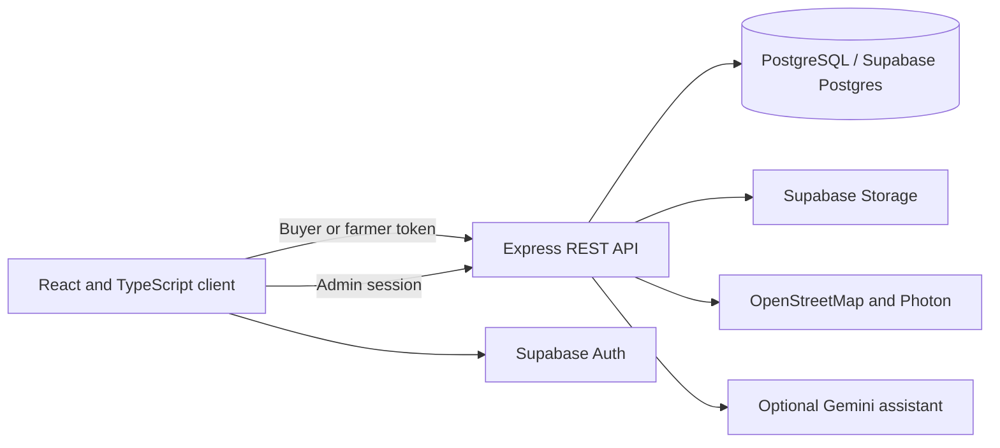
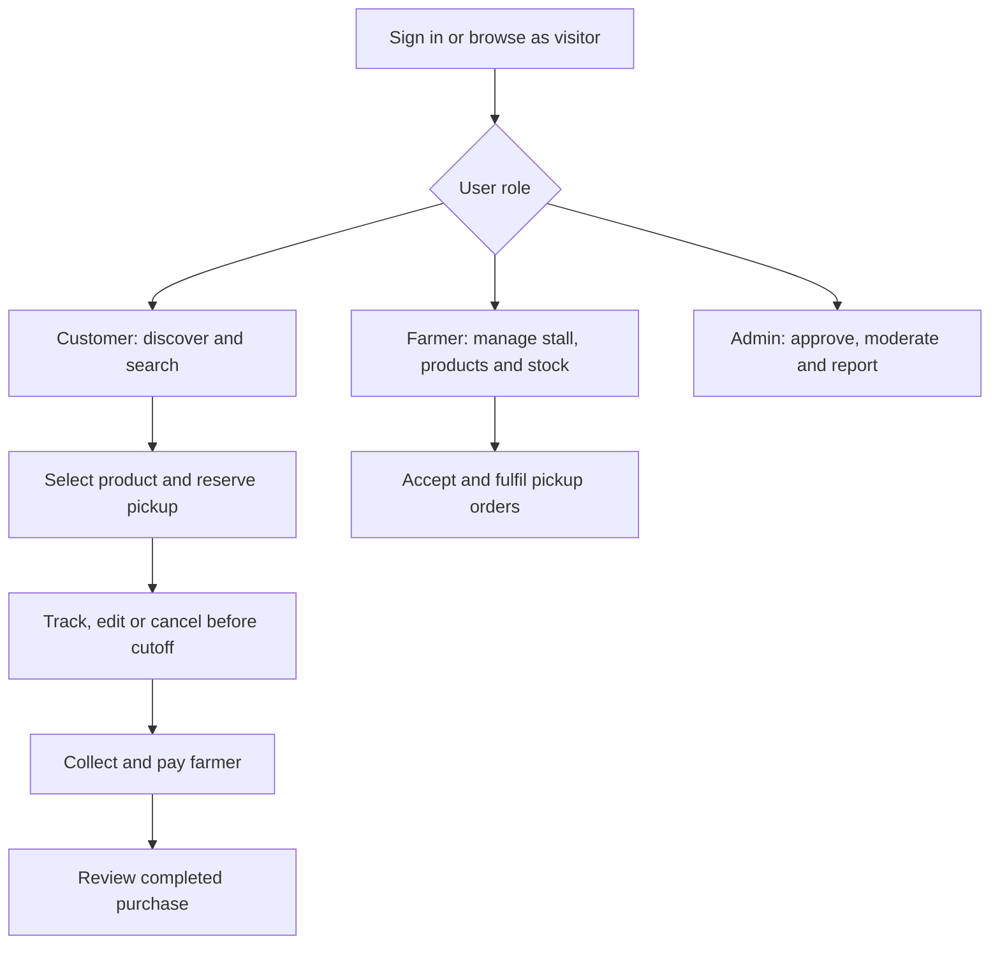
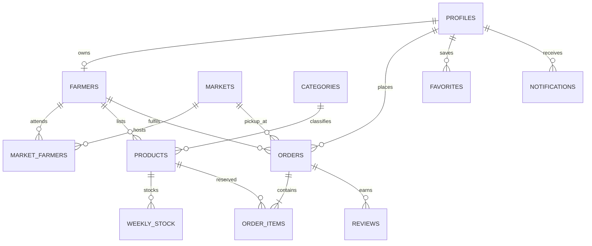

# MarketLink Project Report

**Document status:** implementation report and SRS compliance review
**Reviewed:** 29 September 2026
**Requirements source:** `docs/reference/MarketLink End-to-End Web Solutions_SRS.pdf`

## 1. Project overview

MarketLink is a responsive marketplace that helps shoppers find farmers, markets and produce, then reserve products for scheduled pickup. Farmers manage stalls, products, weekly stock and pickup orders. Administrators manage access, approvals, listings and reports. Payment is made to the farmer at pickup; online payment and delivery are outside the documented scope.

The SRS describes a problem where shoppers cannot reliably know which farmers, products and prices will be available before travelling, while farmers have limited ways to announce stock and take preorders. MarketLink addresses this with searchable listings, market schedules, stock-aware reservations and role-specific workspaces.

### Goals

- Let customers discover farmers, produce and pickup markets before travelling.
- Allow customers to reserve available products and manage orders before the seller's cutoff.
- Give farmers tools to maintain listings, stock, pickup arrangements and order status.
- Give administrators controls for approvals, moderation, accounts, markets and reports.
- Provide a responsive interface, map-based discovery and useful in-app notifications.

### Scope and constraints

The application supports customers, farmers and administrators. Customers pay in person at collection. Orders are grouped by farmer and market, and an individual order belongs to one farmer and one pickup market. There is no payment gateway, delivery dispatch or automatic refund flow. Production availability, backups, cross-browser compatibility and accessibility conformance require deployment or independent evaluation and are not claimed as proven by this source review.

## 2. System design

### Architecture



The browser is built with React, TypeScript and Vite. The Node.js/Express API validates requests and accesses PostgreSQL. Supabase provides customer/farmer authentication and image storage. Administrator authentication uses a server-verified password and signed session. The service-role key, admin password and Gemini key belong only in the server environment. Map discovery uses OpenStreetMap/Photon. The site-scoped assistant can search public active listings and current weekly stock; when Gemini is configured it can also answer general MarketLink help questions. It cannot access private accounts or orders.

### User flow



### Data design

| Entity | Responsibility |
|---|---|
| `profiles` | Customer/farmer identity and account state, associated with auth identity. |
| `farmers` | Farmer stall profile, approval, pickup schedule and location. |
| `markets` | Market identity, place, coordinates, operating schedule and active state. |
| `market_farmers` | Farmer-to-market roster and trading days. |
| `categories`, `products` | Product classification and farmer-owned listings. |
| `weekly_stock` | Product quantities by ISO week and sold-out state. |
| `orders`, `order_items` | Pickup reservation, status and item/price snapshots. |
| `favorites` | Saved farmers, products and markets. |
| `reviews` | Ratings and comments linked to completed orders/products, with moderation and farmer reply. |
| `notifications` | In-app order, restock and announcement messages. |



Database changes are versioned in `db/migrations/`; Lagos demo data is in `db/seed/`. Row-level security and guarded stock updates protect data access and prevent overselling. See [database setup and checks](../db/README.md) for migration and seed details.

## 3. SRS requirement review

Status means source-level implementation found during this review. “Partial” means a related feature exists but misses a stated detail or needs configuration. “Unverified” means source inspection/build cannot establish the live or operational requirement.

| SRS requirement | Status | Evidence and remaining work |
|---|---|---|
| Customer/farmer registration and sign-in | Meets in source | Supabase-backed flows collect role-specific profile details; farmer profiles enter approval flow. Live provider configuration must be supplied. |
| Market and farmer discovery, operating days and maps | Meets in source | Market/farmer directory, schedules, map pins and direction links are present. Cross-device/browser behaviour needs hands-on evaluation. |
| Search products by name/category/price/availability and market/day | Meets in source | Catalogue provides search, category, price, stock, market and market-day filters; market/day constraints are applied by the API. |
| Product details, farmer and pickup information | Meets in source | Product details link listings to farmers and pickup markets. |
| Stock-aware pickup preorder, cutoff, tracking and edits/cancellation | Meets in source | Checkout lets customers choose an eligible market/farmer trading date and a 30-minute pickup slot within the configured pickup window. The API validates stock and the seller's cutoff; order status, pre-cutoff changes and cancellation are supported. |
| Order history and reorder | Meets in source | Order history and a **Buy again** action are present for completed orders; availability is checked before restoring products to the cart. |
| Favorites, restock and market notices | Meets in source | Favorites and in-app restock/order/announcement notices exist. |
| Post-completion ratings/reviews and farmer replies | Meets in source | Review eligibility follows completed orders; moderation and seller replies exist. Seed data does not provide a completed order for a ready-made review demonstration. |
| Optional chatbot for MarketLink questions and current listing availability | Meets in source for public listings | Inventory questions use active approved listings and current weekly stock, including market and trading days; general help answers use the server-configured Gemini model. Private account/order data is intentionally unavailable. |
| Farmer profile, map, product/stock CRUD and order handling | Meets in source | Farmer dashboard supports stall and market details, listing/photo edits, recurring/current stock and order lifecycle actions. |
| Farmer sales insights and review response | Meets in source | Dashboard includes order/sales summaries and top sellers; farmers can respond to reviews. |
| Admin login, approval, account controls, market/category CRUD and moderation | Meets in source | Protected admin workspace contains these controls and reporting views. Configured admin credentials are deployment-owned. |
| Admin revenue/order and active-farmer reports | Partial | Dashboard reports exist; accuracy and completeness need verification against a live seeded transaction dataset. |
| Contact/About pages and Google map | Partial | Pages exist; public Contact details/map coordinates must be configured and verified. Map discovery itself uses OpenStreetMap. |
| Responsive, usable, accessible UI | Partial | Responsive layouts, semantic/labeled controls and reduced-motion handling are present. This is not a WCAG audit; assistive technology and device/browser checks remain. |
| Security, performance, scalability and 24/7 availability | Partial / unverified | JWT role checks, server-only secrets, request validation, rate limits and database policies are present in code. No independent security assessment, load test, uptime evidence or operational backup evidence was supplied. |
| Required project documentation and diagrams | Meets in this repository | This report includes problem, scope, design and data diagrams; README and linked guides cover setup. Verify author-specific submission formatting with the instructor. |
| Demo data, role credentials and installation guidance | Partial | Seed/setup instructions and customer/farmer credentials are provided. Admin uses privately configured environment credentials; successful end-to-end demo setup still needs confirmation. |
| Required demonstration video | Not met in repository | A walkthrough outline exists in [demo-video-script.md](demo-video-script.md); the required recording has not been supplied. |

### Overall finding

The source now includes the catalogue market/day filters, selectable pickup times and live public-listing assistant called for by the remaining functional gaps in this review. Full SRS readiness still depends on exercising these flows against configured data, resolving automated test failures, configuring Contact/admin settings, and obtaining operational evidence for availability, backups, scale, security and browser compatibility. The demonstration video remains a separate SRS submission deliverable.

## 4. Test and build evidence

The production build completed successfully after the remaining feature changes. Before this feature update, the test suites reported **10 server failures and 128 passes (138 total)**; the client suite reported **31 failures and 49 passes (80 total)**. The suites have not been rerun after these changes. Treat automated test status as unresolved until failures are reviewed and all suites are rerun. The previous counts do not prove that each failure represents a user-visible defect, and no clean baseline comparison was available.

The production build emits an optional 3D scene chunk of approximately **551.92 kB raw / 140.1 kB gzip**; it is dynamically loaded. The largest initial client JavaScript chunk is approximately **499.62 kB raw / 146.21 kB gzip**. Vite warns about the raw 3D chunk size. These bundle measurements are not a real-device speed or Core Web Vitals measurement; evaluate on target phones and networks before making performance claims.

## 5. Installation, test data and access

Use [README.md](../README.md) for prerequisites and local startup, [db/README.md](../db/README.md) for migrations/seeds/tests, [site-guide.md](site-guide.md) for user workflows, and [admin-access.md](admin-access.md) for administrator setup. Main commands from the repository root:

```bash
npm install
npm run db:migrate
npm run db:seed
npm run dev
npm run build
npm test
```

The database seed/test contract specifies 3 markets, 5 categories, 29 farmer stalls (28 approved and 1 pending), and 80–100 products. Seeded customer and farmer emails and their isolated-demo password are listed in the root README. The administrator has no safe checked-in password: set `ADMIN_EMAIL` and a private `ADMIN_PASSWORD` in `server/.env`; do not put that password in this report or source control. Follow `db/README.md` if the Supabase project does not permit the seed to create auth users. The complete table map, relationships and test inventory are in [database schema and tests](database-schema-and-tests.md).

## 6. Evaluation checklist

- [ ] Set up Supabase, database, storage bucket and public Contact settings.
- [ ] Set private admin credentials and verify admin access.
- [ ] Sign in as customer and farmer; demonstrate product search including market/day filters, pickup time selection, stock changes and order completion.
- [ ] Demonstrate review eligibility, farmer response and admin moderation using a completed sample order.
- [ ] Resolve or document all automated test failures; run database tests with pgTAP enabled.
- [ ] Check layouts and interactions on representative phones, tablets and laptop browsers; test keyboard and screen-reader flows.
- [ ] Record and include the SRS-required demonstration video.
- [ ] Confirm image licenses/attributions and replace any demo content that is not approved for publication.
- [ ] Have the project authors review, correct and approve this report before submission.

## 7. Authorship and AI-tool disclosure

This report was prepared with AI assistance by comparing the supplied SRS with the available repository, source code and build/test output. Project authors must verify the implementation claims, add their own design/development account and decisions, and follow the course's authorship rules before submitting. Do not present this generated review as a substitute for the team's own explanation or required live demonstration.

**Team-authored development account to complete:** Describe the team's actual planning, implementation decisions, challenges, changes made after testing, and individual contributions here.

**Author confirmation:** Names/signatures and date to be completed by the project team.
