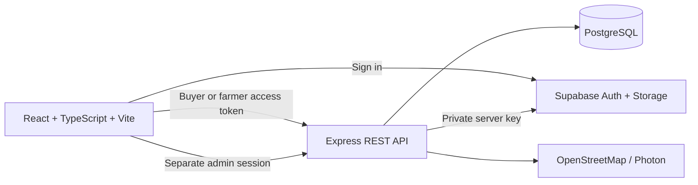

# MarketLink site guide

This guide explains the MarketLink website for shoppers, farmers, administrators and the team running the application. It complements the [project implementation report](project-implementation-notes.md), the [API contract](../openapi.json), and the [database setup guide](../db/README.md).

## What MarketLink does

MarketLink connects shoppers with African farmers and the markets where they sell. Shoppers discover produce and stalls, add products to a cart for a specific pickup market, place an order and pay the farmer in person at pickup. Farmers manage their stall, listings, stock and incoming orders. Administrators oversee the platform, accounts, markets and catalogue.

The site supports country-specific market currencies across the supported African countries. Product prices can be viewed in the selected currency using daily reference exchange rates. Checkout uses the chosen market's actual currency. The site does not offer online card payments, delivery, or automatic currency settlement.

## Roles and access

| Role | Sign-in | Main pages | Main actions |
|---|---|---|---|
| Visitor | No account needed to browse | Home, markets, farmers, products | Search and view listings, markets and farmer profiles |
| Buyer | `/signin` or `/signup` | `/account`, `/favorites`, `/cart`, `/orders`, `/notifications` | Save favourites, place and manage pickup orders, review completed purchases |
| Seller / farmer | `/signin` or `/signup` | `/farmers/dashboard`, `/orders` | Edit stall and pickup details, assign markets, manage products and stock, accept or prepare orders |
| Administrator | `/admin/signin` | `/admin` | Review farmer applications, manage accounts, markets and categories, moderate products and reviews, publish notices, inspect reports |

Buyer and farmer accounts use Supabase Auth. The administrator uses a separate server-verified password and a signed, short-lived admin session; admin pages are protected outside ordinary marketplace navigation. See [private admin access](admin-access.md).

## Buyer journey

1. Browse the home page or open **Markets**, **Farmers** or **Products**.
2. Search by product, stall or market. Product filters narrow by category, price, stock, market and market trading day.
3. Open a product, choose a pickup market and add it to the cart.
4. Review the cart, choose an eligible pickup date and a 30-minute time slot inside the farmer's pickup window, then press **Place order**. The app groups items by farmer and market, checks current stock and the seller's cutoff, and submits one pickup order per group.
5. A successful submission opens **Your orders** and shows **Order placed successfully**. The selected seller receives an in-app order notice and sees the order in **Incoming orders** on the farmer dashboard.
6. Track the order in `/orders`. Before the cutoff, the buyer may change quantities or cancel where allowed. Payment happens in person when collected.
7. After an order is completed, the buyer can review eligible products and the farmer.

The global search remembers the six most recent submitted searches in this browser. On desktop, its filter control reveals the recent-search panel on hover. On touch devices, tap the control to open the panel and tap it again to close it; the input also opens suggestions while typing.

If the cart contains multiple sellers, it creates distinct orders. If one order in a multi-seller cart succeeds before another fails, the buyer is told which references were placed; successful orders are not rolled back across sellers.

## Farmer journey

Farmers complete a stall profile and await administrator approval. Approved sellers can:

- edit stall name, contact details, description, map location and cover photo;
- set weekly operating days, pickup hours and order cutoff minutes;
- choose markets where the stall trades and set its pitch reference and trading days;
- create or update product listings, upload product photos and set recurring stock quantities;
- adjust the current week's stock separately from the recurring quantity;
- view new orders for future and current pickup dates, then accept, prepare, mark ready, complete or decline them;
- review order totals, completed pickup sales and best-selling products.

An order is visible to the farmer associated with its listing and selected market. The farmer view is restricted to that farmer's own orders by the API.

## Administrator workspace

The admin dashboard is at `/admin`, after signing in at `/admin/signin`. It provides:

- platform totals for accounts, farmers, buyers, markets and products;
- farmer application approval and suspension controls;
- buyer and seller account search and enable/disable controls;
- product and review moderation;
- market creation/editing and market-to-farmer roster management;
- product category management;
- completed-pickup reports by market, product and farmer;
- announcements to active accounts.

Admin access is independent of buyer/farmer Supabase sessions. Keep `ADMIN_PASSWORD` private in `server/.env`; never put it in a `VITE_` variable or commit it.

## Main website routes

| Route | Purpose |
|---|---|
| `/` | Discover markets, fresh listings and featured farmers |
| `/markets`, `/markets/:id` | Market search, map and market details |
| `/products`, `/products/:id` | Product catalogue, filters and product details |
| `/farmers`, `/farmers/:id` | Farmer directory and stall profile |
| `/cart`, `/checkout` | Cart and pickup reservation flow |
| `/orders`, `/orders/:reference` | Order history and individual order status |
| `/account` | Buyer or seller account details |
| `/farmers/dashboard` | Seller workspace; requires the farmer role |
| `/favorites`, `/notifications` | Saved items and in-app notices |
| `/admin/signin`, `/admin` | Separate administrator sign-in and protected dashboard |
| `/about`, `/contact` | Project information and contact details |

## Currency and prices

Supported markets are limited to African countries in `client/src/lib/countries.ts` and the matching API schema. A shopper can select a supported country and see local market names and prices in that country's currency. Order records store the currency used by the selected farmer/market; they are not converted during order placement. Reference-rate conversion is for catalogue display and sorting only. If the rate service is unavailable, the catalogue falls back to the seller's currency.

Amounts from the API/database use integer minor units (for example, kobo or pesewas) and are formatted by `client/src/utils/money.ts`. Always use the market/farmer currency for checkout and order records; do not hard-code a currency symbol in a shared component.

## Images and content

- A farmer-uploaded cover or product image takes precedence over the demo image.
- Seeded demonstration farmers use bundled local representative photos on the farmer directory and home page. Legacy Unsplash cover URLs are ignored in favor of these local files. They are illustrative photos, not verified portraits of the named farmers.
- Product cards are shown only when a product has a working photo. A local product-specific fallback is used where appropriate elsewhere in the site.
- Product and stall uploads use the configured public Supabase Storage bucket. Setup and limits are documented in [product image storage](product-image-storage.md).
- Market map tiles and place search use OpenStreetMap data. Farmer demo covers are stored locally; uploaded covers from other allowed hosts may require an internet connection.

## Application architecture

The client lives in `client/`; the API in `server/`; ordered database migrations and demo seed files are in `db/`; this guide and operational notes are in `docs/`. The [database schema and test guide](database-schema-and-tests.md) explains table relationships, integrity rules, seed data and both database/application test suites. The Express API validates requests and returns a consistent JSON error envelope. `openapi.json` is the generated HTTP API contract.

## Local setup

Requirements: Node.js 22 or newer, PostgreSQL (or Supabase Postgres), and a configured Supabase project for real buyer/farmer authentication and image uploads.

1. Install dependencies from the repository root: `npm install`.
2. Copy `.env.example` to `server/.env` and set `DATABASE_URL`, `SUPABASE_URL`, `SUPABASE_SERVICE_ROLE_KEY`, and `CLIENT_ORIGIN`.
3. Set client variables in `client/.env`: `VITE_SUPABASE_URL`, `VITE_SUPABASE_ANON_KEY` and `VITE_API_URL=http://localhost:4000/api`. Optional variables are described in the root `.env.example`; set contact details only when approved for publication.
4. Create the public Supabase Storage bucket `product-images` and configure it as described in [product image storage](product-image-storage.md).
5. Apply schema and sample data: `npm run db:migrate` followed by `npm run db:seed`.
6. Start both services with `npm run dev`. The client runs at `http://localhost:5173`; the API defaults to `http://localhost:4000`.
7. Build a production client and API with `npm run build`.

The API reads `server/.env` at boot, so restart it after changing server settings. `DATABASE_URL` may point at local Postgres while Supabase handles authentication. Never place `SUPABASE_SERVICE_ROLE_KEY` or `GEMINI_API_KEY` in the client environment or any `VITE_` variable. Inventory questions query public active listings and current-week stock from the database. General MarketLink help uses Gemini only after the server receives `GEMINI_API_KEY`; its default model is configured by `GEMINI_MODEL` (currently `gemini-3.5-flash-lite`). User chat text is sent to Gemini for those general-help replies. The assistant cannot access private account or order data.

## Configuration reference

Server settings are validated in `server/src/lib/env.ts`:

| Variable | Purpose |
|---|---|
| `PORT` | API listening port (default `4000`) |
| `NODE_ENV` | `development`, `test` or `production` |
| `DATABASE_URL` | PostgreSQL connection string |
| `SUPABASE_URL` | Supabase project URL |
| `SUPABASE_SERVICE_ROLE_KEY` | Server-only Supabase administrative key |
| `ADMIN_EMAIL` | Sole admin email; defaults to `wilsontechtechy@gmail.com` |
| `ADMIN_PASSWORD` | Private admin password; blank disables admin sign-in |
| `SUPABASE_PRODUCT_BUCKET` | Image bucket (default `product-images`) |
| `CLIENT_ORIGIN` | Allowed browser origin |
| `GEMINI_API_KEY` | Optional server-only key; without it the assistant cannot answer requests |
| `GEMINI_MODEL` | Gemini model name (default `gemini-3.5-flash-lite`) |
| `GEO_USER_AGENT`, `GEO_CACHE_MS` | OpenStreetMap lookup identification and cache period |

The browser also supports `VITE_MAPBOX_ACCESS_TOKEN` for optional satellite previews and `VITE_CONTACT_*` values for the public Contact page. See `.env.example` for the full list.

## Data and order rules

Migrations run manually; the application does not change the database schema at startup. `db/README.md` documents local and Supabase migration flows. Core records include profiles, farmers, markets, market rosters, categories, products, weekly stock, orders, order items, reviews, favourites and notifications.

Each order belongs to one farmer and one market. Its line items capture product name, unit and price snapshots. Stock is reserved atomically against the current ISO week so concurrent orders cannot oversell a product. Pickup dates must be in the current trading week, align with the farmer and market schedules, fall inside the pickup hours and meet the ordering cutoff. Cancelled orders restore stock when the rules permit.

## Troubleshooting

| Symptom | Check |
|---|---|
| API fails to start | Check required server variables and restart after edits. The startup error lists invalid settings. |
| Browser cannot reach API | Confirm `npm run dev` is running and `VITE_API_URL` points at the API `/api` base. |
| Buyer/seller sign-in fails | Verify Supabase URL, anon key, email provider and redirect URL configuration. |
| Product photo upload fails | Check the bucket name, public read policy, farmer session and upload limits in the image-storage guide. |
| Product has no picture | Confirm `image_urls` contains an accessible image URL; product cards intentionally omit products without images. |
| No pickup slot is available | Check farmer operating days, market operating days, roster days, pickup hours, order cutoff and current-week stock. |
| Order placement reports an error | Use the displayed request reference to correlate with the API's structured server log. In development, internal failures may include a diagnostic. Do not expose diagnostic details in production. |
| Admin sign-in is unavailable | Set a private non-empty `ADMIN_PASSWORD` in `server/.env`, verify `ADMIN_EMAIL`, and restart the API. |
| Prices show the seller's currency | The exchange-rate service may be unavailable; retry when connected or check the source market currency. |

## Scope and operating notes

MarketLink is a pickup marketplace: payment is made directly to the farmer at collection. Payment processing, delivery dispatch, refunds through a payment gateway and guaranteed real-time exchange settlements are not implemented. Demo credentials and sample content are for isolated evaluation only. Configure production authentication, administrator secrets, contact information, storage policies, backups and deployment origins before making the site public.
